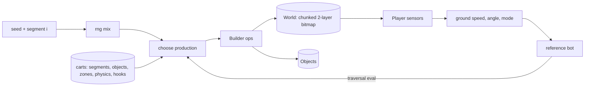

# Architecture

## The model in one line

**Seed → grammar → bitmap → sensors → state.** A seeded sampler picks productions from a grammar; productions paint a two-layer collision bitmap; a sensor-based state machine reads the bitmap; a bot closes the loop by testing whether the grammar's output can be played.

## Analogies that carry weight

| Here | S3K hardware | Why it matters |
|---|---|---|
| `createCore()` | the console | Deterministic, headless, knows no content |
| `base` cart | the Sonic & Knuckles cartridge | Ships the content, uses the public API |
| `lockOn(cart)` | the lock-on slot | Mods compose; same id overrides |
| 128×128 chunks of 16×16 blocks | S3K level layout | Same granularity as the original data |
| Layer A / B + swappers | S3K "paths" + plane switchers | How a 2D bitmap holds a loop you enter and exit |
| Bot eval | playtesting | Rejection criterion for the grammar |

## Core

- **World** (`world.js`). One byte per pixel: solid-on-A, solid-on-B, top-only, material. Unbounded in x, 2048 px tall, pruned behind the player. `cast()` is the only collision primitive: a ray of up to 32 px that returns signed distance to a surface. `angleAt()` fits a chord through probes either side of a hit and rejects jumps of more than 10 px as ledges, so ledges read flat and curves read curved.
- **Player** (`player.js`). Ground speed `gsp` runs along the surface. The angle picks one of four modes (floor, right wall, ceiling, left wall), and the same sensor code rotates through all four. That's why loops need no special-case code. Push sensors rotate too, and the surface turning more than 50° is what counts as a wall, so a loop's quarter-pipe is a slope while a cliff is a wall.
- **Generator** (`generator.js`). A segment is a production `(entry height, difficulty, rng) → (terrain, objects, exit height)`. Segment 0 is `start`; every 10th is `checkpoint`; the rest are weighted by difficulty `d = 1 − e^(−i/40)`, never repeating the same id twice in a row.
- **Core** (`core.js`). Rings, lives, checkpoints, pit deaths, zones, hooks. Events per frame (`ring`, `jump`, `spring`, …) are the only channel to the shell.

## Invariants (the eval enforces them)

1. Determinism: same seed and carts, same world, same bot run.
2. Every uphill ≤ ~20°, the grade where slope factor (0.125·sin θ) drops under acceleration (0.046875). A stopped player can always walk out.
3. Standing still on a floor-mode slope is stable (S2/S3K rule), so a stuck player can crouch and spindash.
4. Every pit gets ≥ 288 px of runway. Platform gaps plus platform length ≥ the full-speed jump range, so a committed jump lands.
5. Loops fill their lower outside down to the floor. No acute overhang exists for a player to run into from the convex side.
6. A hazard is on screen for at least 0.5 s before contact. The builder integrates expected speed (`v dv = (accel − slp·sin θ) ds` per column); hazard productions declare `maxSpeed`, and the generator inserts a `brake` climb (rise = (v² − top²) / 2·slp) when the player would arrive faster.
7. Falling costs time, not a life, until difficulty 0.55: gaps and platform runs get catch floors with a spring back up.
8. No walls in the running line: rises are ramps.

9. Walls are climbable only where a climber fits: Knuckles grabs near-vertical rock, never cracked rock (it shatters) or a curve leaning over him, and lets go if pinned.
10. Crumbling bridges have gaps under 40 px, so speed carries you across; a fallen bridge rebuilds on respawn so a checkpoint never faces an empty pit.
11. A move-using player is part of the eval: both test players glide gaps wider than 70% of their jump range, climb walls taller than 80% of jump height, spindash into cracked rock when slow, and run straight over gaps short enough to cross on speed.

12. Timed hazards publish their own forecast. A crusher exposes `openAt(o, dt, head)`, an exact replay of its cycle; anything else timed exposes `clearFor(o)`. Test players forecast their run past every one ahead at the speed they'd carry, stop short when a window would close on them, and rev a spindash to go when it opens. Once braking can't stop them short, they commit.
13. Nothing loops forever. A bounce that doesn't hurt (lava while still flashing) hands control back; a monitor never sits under a bumper you'd hit hopping it.

Invariants 1–5 came from failures the expert bot found. 6–8 came from the reaction-time runner. The expert proves a level *can* be cleared; the runner proves it's *fair* to someone holding right. Before the fairness rules, the same runner died 3.2 times per 100 segments (14 in zone 1 across 60 seeds); after, 0.1, all in deliberate late pits.

The loop: **add a production → `npm test` → read the per-segment tables → fix geometry or add an invariant.**

## Set pieces: one primitive each

The S3K set pieces reuse three primitives instead of special cases:

- **Liquids** are spans `{x0, x1, y, kind}` beside the bitmap. Entering water swaps the physics table (half speed, low gravity) and starts the air clock; lava hurts and bounces. A water surface also carries a `SKIM` film in the bitmap that is solid only while the player moves faster than 6.5 px/frame, so running on water is the same floor code as running on grass.
- **Object-owned solids** (`MAT.METAL`) let monitors and crushers be terrain the sensors already understand. The object rewrites its pixels as it moves; the renderer skips them and lets the object draw itself.
- **Physics tables per state.** `physicsFor(wet, shoes, super)` composes multipliers onto the cart physics and caches them. Speed shoes underwater and Super underwater fall out without extra code.

## Biomes

A zone is a genome sampled once from (seed, zone index): identity (name, mood, palette, ground pattern, skyline) and structure (production weights, height and length scales, loop bias). Weights multiply the base grammar's weights, so a zone *leans*: a loop zone, a platform zone, a hill zone. The speed budget and catch floors run beneath every genome, so variety never buys back traps. The fairness and traversal tests sample hundreds of zones per run.

Palettes are built in HSL from the mood: sky hue first, grass hue kept at least 40° away from it, soil warm or complementary, everything darker at dusk and night. A quarter of the time a hand-made palette comes round instead.

## Shell

Renderer paints each chunk once into a cached canvas: color comes from the zone palette and each pixel's depth below the surface (grass band → dark line → strata). Parallax strips are generated per zone. The camera lives in the core (`camera.js`) so the fairness test sees exactly what the screen shows: S3K-like caps (16 px/frame) plus look-ahead up to 136 px at speed.

Effects (`effects.js`) layer what's cosmetic: water tint and surface, lava glow, the four shields, invincibility stars, Super's tint and sparkles, splashes, skim spray, embers, the drowning countdown. It reads the core and never writes it, so it can use `Math.random`.

Skins (`skin.js`) map player state to S3K's animation set and timing (walk and run frames hold `8 − |gsp|` frames, roll `4 − |gsp|`), rotate in 45° steps like the original's pre-rotated frames, and key out the sheet's background color.

## Where to take it next

- **Branching routes.** Multi-path segments (upper/lower) with their own exit heights that rejoin. `skyways` is the first step.
- **Online validation.** Simulate the bot through a candidate segment before committing it (rejection sampling with the real physics as the oracle) instead of relying on offline eval alone.
- **More characters.** `glide` shows abilities as hooks. Climbing (wall-mode grab) is the next hook.
- **ROM adapter.** A loader that reads chunk and collision data from a user-supplied S3K ROM (offsets per the skdisasm disassembly) into the same `World`, so authored acts and generated acts share one engine. Never distribute the ROM.
- **Learned productions.** Fit segment weights to player telemetry (deaths, speed, ring pickups) per seed. The grammar is the action space.
